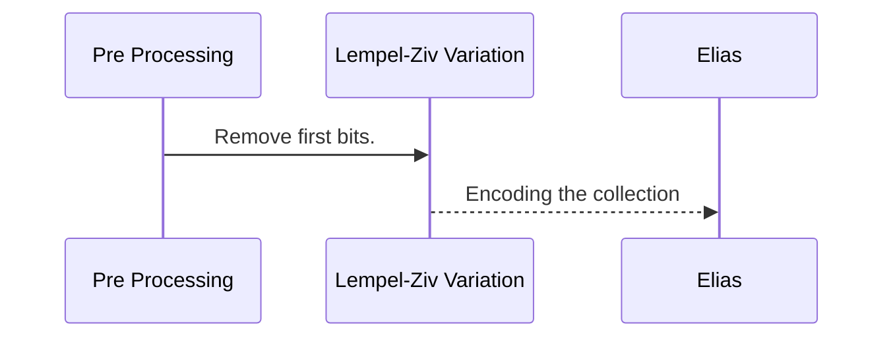
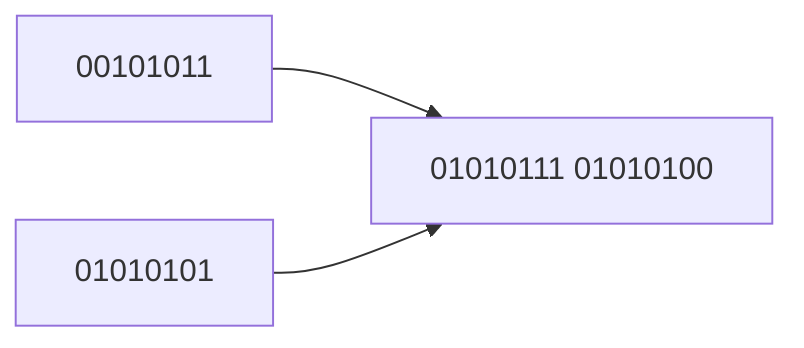
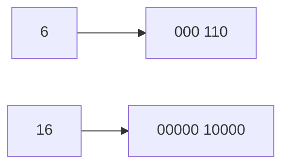

# Data Compression Algorithm


This algorithm compresses and decompresses the data efficiently.
The algorithm uses the combination of Lempel–Ziv, Elias, and Custom pre-processing which ensures that data could be decompressed and compressed  and used as a universal lossless data compression algorithm .

## Interface

The class supports 2 public static function:

| Function| Description| Input | Output |
|----------------|-------------------------------|-----------------------------|-----------------------------|
|**byte_compress**| Compresses data| data and length | the new length is returned and compressed data is overwritten in the original buffer                 |
|**byte_decompress**       |Decompresses data| data and length |    the new length is returned and decompressed data is overwritten in the original buffer 

*The data buffer need to be ensured that allocated correctly in size in order to fit decoded/encoded output

## Algorithm




In the algorithm 3 techniques are utilized in order to reach high efficiency.

### Step 1: Pre Processing
Since we know each byte is between range 0-127, the first bit is removed form each byte, and new buffer is created. 
*for the remaining the 0 are added.



### Step 2: Lempel-Ziv Variation
After we process the data, we have full entropy universal data where there might be repetitions. In order to reach full universal encoding and efficiency, let use our implementation Lempel Ziv variation.
```
  *     PSEUDOCODE of LEMPEL ZIV
  * 
  1     Initialize lexicon witha  single character
  2     FIRST = first input character
  3     WHILE not end of data
  4          CURR = next input character
  5          IF FIRST + CURR is in lexicon
  6            FIRST = FIRST + CURR
  7          ELSE
  8            save the code for FIRST
  9          add FIRST + CURR to the Lexicon
  10           FIRST = CURR
  11         END WHILE
  12    output code for FIRST
  ```
  
### Encoding the collection

After we build a collection, the collection is encoded. At first the min number of bits is calculated to encode each value. and each value in the sequence is written with number of bits to the ouput stream. Before the stream, we need to know how many element were there and what was the length used for encoding. For this Elias algorithm for number encoding is used.


### Elias encoding 
For example 6, number takes minimum 3 bits to encode. Therefore 6 goes to 110, however we need to save the number 3, the first 3 is encoded in unary with number of 0's, The final encoding would be 000110



### Decompressing

For decompression, the  algorithm is applied from backwads.

```
  *     PSEUDOCODE of Decompress
  * 
  1     Decode elias and get the  number of elements
  2     Decode elias and get the  number of bits for elements
  3     Rebuild Lexicon
  4     Add 0 bits of each 7 bit
  5     Finiize in data array
  ```
         
### Optimization 
1) In the optimized version, we could optimize 2 lengths with only 1 but for large data this would save negligible bits.
2) For small datasets, we may end up with bigger data; Since we know each bit is <=127, we could utilize first bit if it is encrypted or not and always ensure that data is <= actual size [Applied]

# Verification

The unit test coverage is provided for the solution.

Unit tests include:
- TEST_METHOD(TestSimple1) - Simple case 1, Requirement Compress <-> decompress
- TEST_METHOD(TestSimple2) - Simple case 2, Requirement Compress <-> decompress
- TEST_METHOD(TestBig1) - Randomized cases, 5% repeate, Rate:>2x
- TEST_METHOD(TestBig2) -  Randomized cases, 10% repeated
- TEST_METHOD(TestBig3) - Full entopy test

## Performance
In the main file the test run is included to evaluate algorithm. The test run generated 10000 bytes with 10% of repeat probability. 

Compressed Length: 1602
Original/Decompressed Length: 10000

COMPRESSION RATE: **6.2422**,  
**16.02%** of original size

## Contact

Please open the issue in case of any improvement, or questions.

